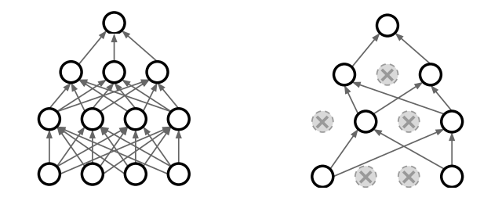
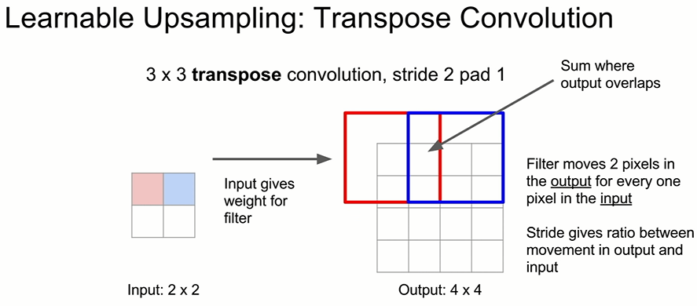

# c231n_summary

## 목차
- [c231n_summary](#c231n_summary)
  - [목차](#목차)
  - [1. Image classificaiton](#1-image-classificaiton)
    - [1.1 Nearest Neighbor](#11-nearest-neighbor)
    - [1.2 K-Neareast Neighbor](#12-k-neareast-neighbor)
    - [1.3 Linear Classifier](#13-linear-classifier)
  - [2. Loss Function and Optimization](#2-loss-function-and-optimization)
    - [2.1 Loss](#21-loss)
    - [2.2 Loss Function](#22-loss-function)
    - [2.3 Optimization](#23-optimization)
  - [3. Backpropagation and Neural Networks](#3-backpropagation-and-neural-networks)
    - [3.1 Computational Graph](#31-computational-graph)
    - [3.2 Back Propagation](#32-back-propagation)
  - [4. Neural Networks](#4-neural-networks)
  - [5. Convolutional Neural Networks](#5-convolutional-neural-networks)
    - [5.1 Filter & Stride](#51-filter--stride)
    - [5.2 Padding](#52-padding)
    - [5.3 Pooling](#53-pooling)
  - [6. Training Neural Networks](#6-training-neural-networks)
    - [6.1 Activation Functions](#61-activation-functions)
    - [6.2 Data Preprocessing](#62-data-preprocessing)
    - [6.3 Weight Initialization](#63-weight-initialization)
    - [6.4 Batch Normalization](#64-batch-normalization)
    - [6.5 Fancier Optimization](#65-fancier-optimization)
    - [6.6 Regularization (drop out)](#66-regularization-drop-out)
    - [6.7 Transfer Learning](#67-transfer-learning)
  - [7. Deep Learning Software](#7-deep-learning-software)
    - [7.1 CPU vs GPU](#71-cpu-vs-gpu)
    - [7.2  Deep learning framework](#72--deep-learning-framework)
  - [8. CNN Architectures](#8-cnn-architectures)
    - [8.1 AlexNet](#81-alexnet)
    - [8.2 VGGNet](#82-vggnet)
    - [8.3 GoogLeNet](#83-googlenet)
    - [8.4 ResNet](#84-resnet)
  - [9. Recurrent Neural Networks](#9-recurrent-neural-networks)
    - [9.1 Vanilla RNN](#91-vanilla-rnn)
    - [9.2 Backpropagation through time](#92-backpropagation-through-time)
    - [9.3 Image Captioning](#93-image-captioning)
    - [9.4 Image Captioning with Attention](#94-image-captioning-with-attention)
  - [10. Detection and Segmentation](#10-detection-and-segmentation)
    - [10.1 Semantic Segmentation](#101-semantic-segmentation)
    - [10.2 Classification and Localization](#102-classification-and-localization)
    - [10.3 Object Detection](#103-object-detection)
  - [11. Visualizing and Understanding](#11-visualizing-and-understanding)
    - [11.1 First & Last Layer](#111-first--last-layer)
    - [11.2 Visualizing Activations](#112-visualizing-activations)
    - [11.3 Maximally Activating Patches](#113-maximally-activating-patches)
    - [11.4 Occlusion Experiment](#114-occlusion-experiment)
    - [11.5 Saliency Maps](#115-saliency-maps)
    - [11.6 Intermediate Features via guided BackProp](#116-intermediate-features-via-guided-backprop)
    - [11.7 Visualizing CNN features: Gradient Ascent](#117-visualizing-cnn-features-gradient-ascent)
    - [11.8 DeepDream: Amplify existing features](#118-deepdream-amplify-existing-features)
    - [11.9 Feature Inversion](#119-feature-inversion)
    - [11.10 Gram Matrix](#1110-gram-matrix)
  - [12. Generative Models](#12-generative-models)
    - [12.1 Supervised vs Unsupervised Learning](#121-supervised-vs-unsupervised-learning)
    - [12.2 Generative Models](#122-generative-models)
      - [12.2.1 PixelRNN](#1221-pixelrnn)
      - [12.2.2 PixelCNN](#1222-pixelcnn)
      - [12.2.3 Variational Autoencoders (VAE)](#1223-variational-autoencoders-vae)
      - [12.2.4 Generative Adversarial Networks (GAN)]](#1224-generative-adversarial-networks-gan)
  - [13. Reinforcement Learning](#13-reinforcement-learning)
    - [13.1 Markov Decision Process](#131-markov-decision-process)
    - [13.2 Q-learning](#132-q-learning)
      - [13.2.1 Q_network Architecture](#1321-q_network-architecture)
      - [13.2.2 Experience Replay](#1322-experience-replay)
    - [13.3 Policy Gradient](#133-policy-gradient)
      - [13.3.1 Variance reduction](#1331-variance-reduction)
      - [13.3.2 Actor-Critic Algorithm](#1332-actor-critic-algorithm)


<div style = "page-break-after: always; visibility : hidden">
  \newpage
</div>

## 1. Image classificaiton
이미지 분류, Input으로 사진을 받으면 Output으로 Label을 반환한다. 


위와 같은 사진을 classifier를 이용하여 분류할 수 있다.

  ### 1.1 Nearest Neighbor

  아래의 그림과 같이 이미지의 모든 픽셀을 수치화 하고 다른 이미지와 각 픽셀 값의 차이의 절대값을 취하여 사진 사이의 거리를 측정한다. 아래 그림은 456의 거리를 갖는다. 이와 같은 방법은 각각의 픽셀을 서로 비교하는 원초적인 방법이라 간단하지만 그만큼 학습에 많은 시간이 필요하다.
  
  
  
  
  
  ### 1.2 K-Neareast Neighbor 

  이미지를 평면상에 배치하고 새로운 이미지가 들어왔을때 그 이미지가 이미 배치된 이미지와 가장 가까운 거리에 있는 값으로 label을 예측하는 방법이다. 
    
  


  ### 1.3 Linear Classifier

  $$ f(x,W) = Wx + b $$

  위의 식처럼 선형의 함수 형태로 이미지를 분류한다. 

  

  여기서 W는 임의로 지정한 Weight 값을 행렬로 나열하고 x는 이미지의 픽셀값을 일렬로 정리한다. 그 결과로 얻은 score에 따라 현 이미지의 label을 예측한다.

<div style = "page-break-after: always; visibility : hidden">
  \newpage
</div>


## 2. Loss Function and Optimization
  ### 2.1 Loss
  Loss는 선형분류에서 하나의 예측값이 선형함수로 부터 얼마나 차이가 있는지 나타내는 하나의 값으로 이 값이 클 수록 손실 값이 큼을 의미한다.
  Loss는 정의하기에 따라 다양하고 이 강의에서는 Softmax와 SVM을 소개한다.

  $$ L_i = -log(\frac {e^{sy_i}}{\sum_j e^sj}) $$

  $$ L_i = \sum_{j\neq y_i} max(0,s_j-s_y+1)$$

  ### 2.2 Loss Function 
  Loss Function은 학습이 얼마나 잘 이루어 질 수 있는지 비교할 수 있는 기준되므로 기계학습에 있어 앞으로 Hyperparameter를 수정하는데 중요한 단서가 된다. Loss function은 Loss들의 총합에서 전체 개수를 나눈 값으로 다음과 같이 정의한다.

  $$ L(W) = \frac{1}{N} \sum_{i=1}^N L_i(f(x_i,W), y_i)$$


  Loss function을 정의할 때 Regularization을 추가하는 것이 좋다.

  $$ L = \frac{1}{N} \sum_{i=1}^N \sum_{j \neq y_i} max(0, f(x_i;W)_{y_i} + 1) + \lambda R(W) $$

  

  정규화 과정이 없다면 왼쪽 그래프처럼 일부 값이 우연히 일치 하는 것으로 학습이 완료되었다 착각하고 학습이 조기에 종료될 수 있다.

  ### 2.3 Optimization

  위에서 Loss Function을 정의했다. 기계학습에서는 이 Loss Function의 값을 최소화 할 수 있는 Parameter를 설정하는 것이 중요한 목표이다. Loss Function의 값을 최소화하기 위해서는 임의의 값을 무한하게 검색하여 그중에 가장 작은 값을 취할 수 있지만 굉장히 비효율적이다.

  


  위 그림에서 J 즉 Loss function의 값이 가장 낮은 곳으로 진행해야 한다면 오른쪽에서 왼쪽으로 진행해야 하는데 이는 매 순간에서의 gradient를 구하고 그 만큼 진행해 나가며 최적의 cost 값을 제공하는 Weight를 찾을 수 있다.

  $$ W_x = W_x - \alpha \frac{\partial Error}{\partial W_x} $$


<div style = "page-break-after: always; visibility : hidden">
  \newpage
</div>

## 3. Backpropagation and Neural Networks

  ### 3.1 Computational Graph

  

  x와 W를 곱해서 score를 얻고 score를 통해서 data loss를 얻고 이것을 Regularization과 더해주는것 , 하나의 숫자로 표현되는 전체의 과정을 Compuational Graph라고 한다.

  ### 3.2 Back Propagation 

  앞에서 공부한 Optimization은 단순한 함수 형태에서는 Gradient를 쉽게 얻고 그에따라 W를 수정해가며 Optimization을 진행했다. 하지만 Computational Graph처럼 복잡하게 구성되고 많은 W가 있다면 어떻게 Optimization을 진행할 수 있을까?
  Computational Graph 에서 말단까지 연산을 마쳤다면 말단에서 다시 역방향으로 진행하여 각 노드에서 W를 수정하는 방법을 생각해보자. 각각의 Gradient는 편미분을 활용하고 나아가 Chain Rule을 적용하여 진행하면서 재귀적으로 구할 수 있다. 이러한 방법을 Backporpagation이라고 한다.

  

  위의 그림에서 우리가 구해야 할 Gradient는 local gradient라 하며 아래와 같다.
  $$ {\partial{f}\over \partial{x}}, {\partial{f}\over \partial{y}}, {\partial{f}\over \partial{z}}$$

  각각의 Gradient는 말단의 Gradient가 1 인 상태로 시작하여 Back Propagation을 진행한다.

  $$ {\partial{f}\over \partial{f}} = 1 $$

  먼저 z의 Local Gradient는 
  $$ {\partial{f}\over \partial{z}} = q =3 $$

  x와 y의 Local Gradient는 모두 chain rule을 적용하여 구할 수 있다. 

  $${\partial{f}\over \partial{y}}= {\partial{f}\over \partial{q}} {\partial{q}\over \partial{y}} = {z} = -4$$
  $${\partial{f}\over \partial{x}}= {\partial{f}\over \partial{q}} {\partial{q}\over \partial{x}} = {z} = -4$$

  위에서는 간단한 숫자의 연산으로 backpropagation에 대해 알아보았다. 이미지 처리에서는 이보다 훨씬 많은 숫자의 행렬로 연산이 처리되며 이때 정의된 벡터들이 위와 같은 계산으로 역전파를 구하고 그에 따른 최적의 parameter를 구한다.

  

  <div style = "page-break-after: always; visibility : hidden">
    \newpage
  </div>


## 4. Neural Networks

  Neural Network는 컴퓨터가 알고리즘으로 처리할 수 없는 일을 해결하기 위해 인간의 신경망 구조를 모방하여 만든 computational graph이다. 오래동안 해결 할 수 없었던 XOR 게이트 학습을 성공시킨 주요한 열쇠이기도 하다. 

  

  인공 신경망은 사람의 신경망과 마찬가지로 특정 자극에 대해 특정 뉴런이 흥분하여 전기적 신호를 보내는 구조를 가지고 있다. 사람의 신경망에서는 신경세포가 그 역할을 한다면 인공신경망에서는 Sigmoid activation function이 특정한 자극에만 신호를 보낼 수 있도록 설계한다. 

  

  인공신경망에는 시작부에 정보를 입력받는 input layer와 중간에 신호를 받고 전달하는 hidden layer, 그리고 말단부에 결과를 출력하는 output layer가 있다. 이 과정에도 위에서 배웠던 back propagation 과정을 통해 인공신경망을 학습시킬 수 있다. 위와 같이 모든 신경이 연결 되어 있는 신경망은 Fully-connected layer는 모든 신경망이 연결되어 있는 구조로, 모든 정보전달에 모든 노드가 관여하는 구조이다.


  <div style = "page-break-after: always; visibility : hidden">
    \newpage
  </div>


## 5. Convolutional Neural Networks

Convolutional Neural Network는 Fully connected Neural Network과 layer 사이의 모든 노드가 연결되어있지 않고 일부 소실 되어있다. 이와 같은 구조는 입출력 데이터 형상을 유지할 수 있고 복수의 필터로 이미지의 특징을 추출 및 학습할 수 있으며 추출한 이미지의 특징을 모으고 강화하는 Pooling 레이어를 활용할 수 있다. 


fully connected layer의 경우 이처럼 모든 픽셀을 한 줄로 stretch하기 때문에 원래의 이미지 특징을 가지고 있기 어렵다.

다음 세가지 convolution의 중요한 키워드를 알아보자.

  ### 5.1 Filter & Stride

  filter는 보통 NxN 형태의 행렬로 이 행렬로 모든 이미지의 부분을 지정된 간격으로 순회하며 filter행렬의 모든 행렬과 이미지와 겹치는 부분의 원소를 서로 곱하고 더함으로 feature map을 완성한다. 이때 지정된 간격은 stride로 정의한다.

  
  

  ### 5.2 Padding

  필터를 활용하여 이미지를 feature map으로 표현하고 나면 feature map의 크기가 작아짐을 확인 할 수 있다. feature맵 주위에 원래 이미지 크기와 같을 수 있도록 0으로 채움으로써 convolution layer의 출력 데이터 크기가 줄어드는 것을 방지할 수 있다.

  


  ### 5.3 Pooling

  Pooling은 출력데이터에서 크기를 줄이거나 특정 데이터를 강조하는 용도로 사용된다. filter의 경우 행렬 연산으로 결과를 다음 행렬로 옮겨 적어 크기를 줄여갔다면 pooling의 경우 단위크기 내에서 최대값이나 최소값, 혹은 평균값을 반환한다.

  


<div style = "page-break-after: always; visibility : hidden">
  \newpage
</div>

## 6. Training Neural Networks

위에서는 CNN의 형태와 개념에대해서 알아봤다. 이번 장에서는 Neural Network 를 학습시키는 방법을 알아보고자 한다 Neural Network를 Training 하기 위해서는 아래와 같은 개념이 필요하다.

  ### 6.1 Activation Functions

  사람의 신경세포는 특정 자극에 대해 더 민감하게 반응하는 세포와 그렇지 않은 세포로 나뉜다. 인공신경망에서도 특정 입력값에 대해 더 반응이 강한 노드와 그렇지 않은 노드가 있다. 이 노드의 활성화를 결정 짓는 것이 Activation Function으로 상황에 따라 그에 맞는 함수를 결정하는것이 중요하다. 

  

  Activation Function은 아래와 같이 다양하다. 

  

  이전 부터 Sigmoid함수를 많이 사용해왔다. sigmoid는 gradient를 계산할 때 미분함수를 구하기 쉽기 때문에 그동안 사용되어왔지만 길게 연결된 인공신경망의 경우 sigmoid를 activation function으로 사용할 때 x 값이 커지거나 작아질 수록 gradient값이 0이 되어서 이후 연산에 gradient가 사라지는 현상이 생겨 Neural Network에서는 특별한 경우가 아닌 이상 잘 사용되지 않는다. 

  

  또 sigmoid 함수는 0이 중심이 아니기 때문에 연산 시 특정 벡터 공간에 한번에 접근 할 수 없기 때문에 update가 느린 단점이 있다. 또 자연상수 e의 사용 때문에 컴퓨터 연산에 효율적이 못하다. 이러한 관점에서 activation function을 비교하자면 아래의 표와 같다. 

  

  ### 6.2 Data Preprocessing

  데이터를 처음 plotting 할 때 원형의 데이터가 처음부터 학습하기 이쁘게 되어 있을리 없다. 이런 정돈 되어 있지 않은 데이터를 정리하여 학습하기 좋은 형태로 만드는 일을 Data Preprocessing 즉 전처리라고한다. 전처리를 시작하기 이전의 데이터를 아래와 같다고 가정하자. 

  

  이 데이터는 현재 아직 완전하지 않다. 먼저 중심을 0으로 보내야 한다. 


  ```python
  X -= np.mean(X, axis = 0)
  ```

  

  그 후 데이터를 정규화 하여 가운데에 몰리게 한다.

  ```python
  X /= np.std(X, axis=0)
  ```

  

  ### 6.3 Weight Initialization

  만약 모든 가중치가 초기값 0으로 설정된 경우를 가정해보자. 이 경우 뉴런들이 동일한 가중치로 연결 되어있어 모든 뉴런이 같은 방식으로 업데이트 될 것이고 이는 학습에 문제가 생긴다.
  가중치는 초기에 임의의 값으로 설정 후 업데이트를 지속하므로써 찾아왔다. 이러한 가중치의 초기값은 어떻게 설정하는 것이 학습에 유리할까? 

  먼저 가중치를 낮은 임의의 값(*0.01)으로 설정하는 경우를 생각해보자. 
  ```python
  W = 0.01*np.random.randn(D,H)
  ```

  

  layer가 깊어짐에 따라 표준편차가 급격하게 떨어짐을 확인할 수 있다. 가중치를 곱하면 곱할수록 너무 작은 값이라 출력값이 급격히 줄어드는 것이다. layer가 진행될 수록 모든 activation이 0이 되는 것이다.

  그렇다면 가중치를 높은 임의의 값 (*0.1)로 설정하는 것은 어떨까?

  ```python
  W = 0.1*np.random.randn(D,H)
  ```
  

  이 경우는 값이 saturation되어 변동폭이 너무 커지고 진행의 결과는 언제나 1 또는 -1이 된다. Gradient는 항상 0이 되기 때문에 더 이상 학습이 진행되지 않는다. 

  현재까지 가장 잘 작동하는 초기 가중치를 설정하는 방법은 Xavier Initialization이다. 이 방법은 이전 노드와 다음 노드의 개수에 의존하는 방법으로 레이어를 가로지르는 

  ### 6.4 Batch Normalization

  Cost function에 normalization을 적용시키듯 gradient에도 normalize를 적용시키는 것이 좋다. 학습하는 과정에서 gradient가 변할 때 그 변동폭이 너무 크게되면 학습에 방해가 되기 때문에 안정화를 시키는 과정이 필요하고 그것에 Batch Normalization이다. gradient가 너무 크거나 작은 경우 사라지거나 폭발한다. 

  

  Batch Normalization은 gradient의 흐름을 향상시키고 더 높은 learning rate 설정을 가능하게 하여 학습의 속도가 빠르며, 초기값 설정에 크게 의존하지 않는 장점이 있다. 

  * Hyper Parameter Optimization

  여기까지 왔다면 모델을 모두 완성시킨 상태일 것이다. 지금까지 위에서 조정했던 모든 parameter는 모델을 새웠으면 학습 과정을 통해 모델이 직접 parameter를 더 나은 값으로 업데이트 한다. 하지만 모델 외에서도 parameter는 존재한다. 이러한 parameter를 Hyperparameter라 한다. Hyperparameter의 예로 learning rate, SVM의 C, K-NN의 K 등이 있다. 

  이러한 parameter는 모델을 만든 사람이 결과를 보고 어떤 값이 가장 좋은지 판단해야하고 이를 위해 다양한 방법으로 어떤 값이 더 좋은지 추정하는 방법이 있다.

  1. Cross validation

  여러분이 중간고사를 앞두고 있다고 가정하자. 중간고사를 준비한다면 당연히 중간고사 시험지를 참고 할 수 없고 오로지 주어진 문제집과 책으로 공부한다. 보통 문제집을 공부하면 80%는 공부 용도로, 나머지 20%는 모의시험 용도로 활용한다. 이러한 학습을 통해 지식이 견고해 진 후 시험에 응시한다. 기계 학습도 마찬가지이다. Dataset이 주어졌다면 우리는 학습과 검증을 위해 test data와 train data를 활용한다. 이때 test data는 test를 위해 마지막까지 아껴줘야 한다. 될 수 있으면 train data로 학습을 완료 해야한다.  한국어로 교차 검증이라고도 하는 Cross Validation은 이처럼 test data에 의존하지 않고 모의시험을 치뤄 학습을 더욱 견고하게 하는 기술이다.

  

  ### 6.5 Fancier Optimization

  이전에 Optimization에서 가장 대표적인 것이 Gradient descent를 설명했다. Gradient descent 그 자체는 전체 함수를 모두 계산하고 진행해가야 하므로 연산에 많은 시간이 소요되는 단점이 있다. 이를 보완한 다양한 Gradient descent를 소개하고자한다.

  * Stochastic Gradient Descent(SGD)
    
    

    기존의 Gradient Descent는 한발의 도약을 위해 모든 데이터를 매 순간 계산해야하는 점이 있었다. 이 때 optimization의 진행 속도가 매우 느려 그 해결책으로 batch 단위로 학습을 진행하는 방법을 고려했다. 

  * Stochastic Gradient Descent with Momentum
    
    $$ v\leftarrow \alpha v - \mu \frac{\partial L}{\partial W} $$

    $$ W \leftarrow W + v $$

    

    Momentum은 관성을 이야기한다. SGD과 비슷하게 기울기를 계산해서 진행하지만 이전에 진행했던 방향을 참고하여 그만큼을 더 이동하게 하는 방법이다. 
    

  $$ h \leftarrow h + \frac{\partial L}{\partial W} \odot \frac{\partial L}{\partial W}$$

  $$ W \leftarrow W - \mu \frac{1}{\sqrt{h}} \frac {\partial L}{\partial W} $$

  위의 optimizer를 활용하다보면 딜레마가 생긴다. Learning Rate가 낮다면 학습 시간이 너무 길고, 반대로 너무 크다면 발산하여 학습이 제대로 진행되지 않는다. 
  AdaGrad는 이러한 한계점을 극복하기 위해 상황에 따라 learning rate를 조정할 수 있도록 element wise multiplication으로 연산한다. 

  * RMSProp

  $$ h_i \leftarrow \rho h_{i-1} + (1-\rho) \frac{\partial L_i}{\partial W} \odot \frac{\partial L_i}{\partial W}$$

  AdaGrad로 learning rate를 조절하여 학습할 수 있었지만 그래도 아직 해결하지 못한 문제가 있다. 간단한 convexfunction에서는 잘 진행되지만 복잡한 다차원 곡면함수에서는 잘 탐색되지 않았다. RMSProp는 기울기를 단순 누적하지 않고 지수 가중 이동평균(Exponentially weighted moving average)를 사용하여 최신 기울기를 더 크게 반영되도록 하였다.

  ### 6.6 Regularization (drop out)

  지난 강의에서 Regularization이란 Loss에 값을 추가함으로 loss에 대한 민감도를 설정하는 과정으로 배웠다. 이번 강의는 neural network에서 진행할 수 있는 regularization 중 Drop Out에 대해 다뤄보고자 한다. Drop out은 간단하면서도 성능을 매우 높여주기 때문에 아주 중요하다.

  

  그림의 왼쪽은 모든 뉴런이 연결된 Fully connected layer이고 오른쪽은 일부가 drop out된 layer이다. 오른쪽의 Neural Network로 학습한다고 가정하면 소실되는 데이터가 없을지 걱정된다고 생각할 수 있는데, 그렇지 않다. 학습에 일부 뉴런이 학습에 참여하지 않을 뿐이다. 다시말해서 학습에 참여하는 뉴런의 개수만 적을 뿐, fully connected layer보다 더 강도 높은 학습 가중치를 갖게 될 뿐이다. 

  

  ### 6.7 Transfer Learning

  Transfer learning은 높은 정확도를 비교적 짧은 시간 낸에 달성할 수 있기 때문에 컴퓨터 비전 분야에서 유명한 방법론중 하나이다. 이를 이용하면, 이미 학습한 문제와 다른 문제를 풀 때에도 밑바닥부터 모델을 쌓아 올리는 대신에 이미 학습된 패턴들을 적용시킬 수 있어 학습시간을 절감시킨다. 

  

  transfer learning은 학습에 시간이 오래 소요되는 CNN과 같은 모델에서 주로 채택되며 전체적은 과정은 다음과 같다.

  1. 사전학습 모델 선택하기
  2. 내 문제가 데이터크기-유사성 그래프에서 어떤 부분에 속하는지 알아보기
  3. 내 모델을 fine-tuning하기 

  fine tuning을 할 경우 데이터 크기와 데이터 사이의 유사성을 바탕으로 비교해가며 진행한다. 

  

<div style = "page-break-after: always; visibility : hidden">
  \newpage
</div>


## 7. Deep Learning Software

  ### 7.1 CPU vs GPU

  GPU(Graphics Processing Unit)는 computer graphics 를 랜더링 하기 위해 만들어진 것으로 CPU와는 일정부분 다른 특성을 가지고 있다. 

  

  위의 표에서 볼 수 있듯 CPU는 코어의 개수가 적다. GPU는 CPU에 비해 훨씬 많은 core를 가지고 있지만 각각의 코어가 더 느린 clock speed 에서 동작하며 그 코어들이 CPU처럼 독립적인 테스크가 있는 것이 아니라 많은 코어들이 하나의 테스크를 병렬적으로 수행한다. CPU는 범용처리에 적합하고 GPU는 병렬처리에 더 특화되어있다. 

  

  이러한 이점을 갖는 GPU지만 아직 한계점이 있다. Model과 Model의 가중치는 GPU RAM에 있지만 Train data는 SSD에 있는 문제다. 이는 데이터를 읽어드릴때 보틀넥 현상으로 이어지기도 한다.

  ### 7.2  Deep learning framework

  Deep learning framework를 사용하는 이유는 다음과 같다.

  * Deep learning framework를 이용할 경우 복잡한 그래프를 직접 만들지 않아도 된다.
  * forward pass를 잘 구현한다면 Back propagation은 알아서 구성되기에 gradient를 쉽게 계산할 수 있다.
  * cuBLAS, cuDNN, CUDA 그리고 memory등을 직접 세심하게 다루지 않고 GPU를 효율적으로 사용할 수 있다. 

  Tensor flow의 place holder는 그래프 밖에서 데이터를 넣어주는 변수이고 varicable은 그래프 내부에 있는 변수이다. 그리고 tensorflow는 분산처리도 지원하기 때문에 서로 다른 머신을 이용해 graph를 쪼개서 실행 시킬 수도 있다. 분산처리를 해야한다면 tensorflow를 활용하면 된다.

  Pytorch이 경우 facebook에서 나왔다. tensorflow와 다른 추상화 레벨을 3가지 정의 해놓았다. 

  * tensor: Numpy array와 유사한 tensor object 가 있으며 GPU에서 작동한다. (tensorflow의 numpy array)
  * variable: 그래프의 노드(그래프를 구성하고 gradient등을 계산)(tensorflow의 Tensor, Variable, Placeholder)
  * Module: 전체 NN을 구성(tensorflow의 tf.layer, TFSlim, TFLearn)

  TensorFlow는 그래프가 단 하나만 고정된다(static computational graph). 그래프를 구성하는 단계와 구성된 그래프를 반복적으로 돌리는 단계로 나누어 진다. 그외 특징은 다음과 같다.
  * 그래프를 한번 구성해 놓으면 학습시에는 동일한 그래프를 자주 재사용하게 된다.
  * 그래프의 모든 전체적인 연산들을 다 고려해서 만들어 주어야 한다.
  * TensorFlow Fold라는 TF 라이브러리가 static graph으로 만든 트릭으로 dynamic graphs를 작성하게 해준다.


  

  반면에 pytorch는 하나의 단계로 구성된다.(Dynamic computational graph) 
  * 매번 forward pass할 때 마다 새로운 그래프를 구성한다.
  * 또한 그래프 구성과 그래프 실행하는 과정이 얽혀 있기에 모델을 재사용하기 위해서는 항상 원본 코드가 필요하다.
  * 코드가 훨씬 깔끔하고 작성하기 더 쉽다.
  * tensorflow와는 다르게 python 명령어들을 활용할 수 있다.
  * 다양한 데이터에도 유동적인 네트워크를 만들 수 있다.
  * Recurrent network, Recursive network, Modular networks를 구성할 때 조금 더 편할 수 있다. 

  

<div style = "page-break-after: always; visibility : hidden">
  \newpage
</div>


## 8. CNN Architectures

  앞선 장에서는 CNN의 기본적인 동작 원리를 배웠다. 이번 장에는 CNN의 전반적인 구조에서 어떻게 Model을 쌓아가면 좋을지 숲을 보는 장이라고 볼 수 있다. 대표적으로 가장 널리 쓰이고 성능이 좋다고 평가 받는 CNN구조 4가지(AlexNet, VGG,GoogLeNet, ResNet)을 알아보고자 한다.

  ### 8.1 AlexNet
  ImageNet Classification Cahllenge 에서, 2012년에 처음으로 Convolutional Neural Network를 사용한 AlexNet이 우수한 성적을 거두면서 컴퓨터 비전연구에서 큰 화제가 되었다. AlexNet은 CNN을 깊게 쌓은 심층 신경망 형태이다. 모델의 구조는 다음과 같다.

  * 227x227 크기의 입력 이미지
  * 5개의 Convolutional layer + Max pooling layer
  * 3개의 Fully connected layer
  * ReLU activation function
  
  

  AlexNet의 특징은 다음과 같다.
  * Local response normalization 이라는 정규화 방법을 채택한다.
  * GPU메모리가 모자라 모델을 2개의 GPU에 분리해서 학습했다. 

  Alex Net의 메모리는 Conv layer 가 더 많은 부분을 차지한다. Parameter의 수는 FC layer가 더 많다. Flops(연산량)은 Conv layer가 더 많은 연산을 수행한다.

  ### 8.2 VGGNet
  AlexNet이후로 더 좋은 성능을 보였던 모델은 VGGNet이다. VGG는 네트워크 설계에 대한 Base-line을 제시한 모델이다. AlexNet과 ZFNet은 단순히 trial and error 였고 VGGNet을 통해 네트워크의 확장과 축소를 더욱 쉽게 생각할 수 있다. VGGNet은 두가지 간단한 원칙을 가진다.

  1. 모든 Conv layer는 3x3크기이고 stride와 padding은 1이다.
  2. 모든 Max pool은 2x2크기이고, stride는 2이다. 그리고 Max pool 이후에는 channel을 2배로 늘린다. 

  

  1번의 규칙을 살펴보자. Conv layer의 크기는 클 수도 작을 수도 있는데 왜 VGGNet에서는 정해진 작은 kernel을 고집할까? 

  * 5x5 conv layer는 3x3크기의 conv layer를 2개 쌓았을 때와 같다. 반대로 7x7크기의 layer는 결국 3x3 layer 3개를 쌓았을 때와 같다. 
  * 작은 kernel size의 Conv layer를 여러겹 쌓은 경우에서 파라미터와 연산량이 더 적다.
  * Conv Layer를 여러 겹을 쌓게 될 수록 더 많은 ReLU를 통과하기 떄문에 더 높은 표현력을 갖는다.
  
  위의 내용을 바탕으로 우리는 hyper-pararmeter로서 kernel size를 고려하는 것보다 네트워크의 깊이에 대해 고려하면 된다고 해석할 수 있다.

  2번째 규칙을 따를 경우 메모리는 절반으로 줄어들고 parameter는 4배 증가했으며 FLOPs는 그대로 유지된다. 

  ### 8.3 GoogLeNet
  AlexNet과 VGG를 살펴보면 네트워크의 크기를 증가시킬 수록 더 높은 성능을 가진다는 결론을 얻을 수 있다. 하지만 GoogLeNet은 효율적인 CNN을 설계하는 방법에 더 집중했다.

   
  
  위의 그림을 보면 확실히 이전의 모델과는 차이점이 느껴지는 부분이 있다. layer를 쌓아갈 때 이전의 network에서는 한층에 하나의 layer였다면 GoogLeNet에서는 한층에 여러가지 layer가 병렬적으로 있다. GoogLeNet의 구조에는 4가지 핵심 아이디어가 있다.

  * Stem Network
    
    

    GoogLeNet은 Stem Network기법을 이용한다. Stem Network란 입력 이미지를 아주 낮게 다운 샘플링하는 역할을 수행한다. 이는 초기에 아주 방대한 conv 연산을 피하기 위함이다. VGG에 비해서 연산량이 현저히 낮다.

  * Inception Module

    

    Inception 모듈에서도 VGG와 같이 kernel size를 3x3 고정으로 활용한다. 이 모듈에서 4개의 병렬적인 가지가 있는데 각각 크기가 다른 1x1, 3x3, 5x5, max pool이다. 여기서 1x1 conv 연산은 연산 비용이 비싼 conv 연산을 수행하기 전에 input channel의 차원을 줄여 연산량을 줄이는 방법을 채택한 것이다.

  * Global Average Pooling
  
    
    
    이전에 보았던 AlexNet이나 VGGNet에서는 모델의 마지막이 Fully Connecter Layer임을 확인했다. GoogLeNet에서는 위 두 network에서 기용하는 Flatten 연산 대신 Global average pooling을 사용하여 연산의 효율을 높힌다. 위 그림의 표를 보면 7x7크기의 1024개의 채널이 GAP에 입력으로 들어가서 1024 크기의 1차원 벡터가 출력되는 것을 확인 할 수 있다. 위의 표를 통해 GAP는 VGGNet에 비해 엄청난 양의 parameter를 줄여주었다는 것을 알 수 있다.

  * Auxiliary Classifier

    Auxiliary Classifier는 Batch Normalization이 등장하기 이전, 많은 layer를 가지는 네트워크를 학습하기 위해 사용하던 방법이다. 

    

    위 그림의 빨간색 박스친 공간이 Auxiliary Classifier이다. gradient가 잘 전달 되지 않는 하위 layer를 학습하기 위한 방법으로 기존 모델의 경우 classification 과정을 항상 끝에만 진행하지만 GoogLeNet의 경우 중간에 두번의 classifier를 추가하여 중간에서도 back propagation을 진행하게 한다. 

  ### 8.4 ResNet

  

  2015년에 error을 절반이나 감소시킨 ResNet이 처음 등장한다. ResNet은 이전에 소개한 Network에 비해 굉장히 많은 152개의 layer가 줄을 잇고 잇다. network는 길 수록 gradient가 소실되어 학습이 원활히 진행되지 않는 단점이 있는데 ResNet은 어떻게 이를 극복할 수 있었을까?
  
  Deep Neural Network에 있어서 도약은 Batch Normalization의 공이 크다. 비록 batch Normalization으로 10개 이상의 layer를 학습시키는데 성공했지만, 152개는 커도 너무 크기에 network의 깊이가 깊어질 수록 성능이 좋지 않았다. 후에 연구로 이 현상은 under-fitting으로 해석했다. 이러한 문제를 놓고 사람들은 깊은 모델이 얕은 모델을 모방할 수 있어야 한다는 결론을 내렸다. 즉 네트워크를 수정해서 identity function을 잘 학습하도록 해결해야한다고 생각했다.

  * Residual Block
  
    

    위의 그림처럼 residual block은 다음 layer의 출력에 이전 layer의 입력을 short cut으로 더해주는 방식으로 동작하는 구조이다. 이 방식으로 깊은 네트워크가 얕은 네트워크를 더 쉽게 emulate 할 수 있게 한다. 또한 깊은 네트워크에서 gradient의 흐름을 개선하는데 도움이 된다. Residual block의 경우 gradient의 전달이 short cut을 통해 이루어지기에 더 원활해 진다. 

  위에서 설명한 residual block을 쌓아올려 만든것이 Residual Network (ResNet)이다. 

  

  이러한 형태를 지닌 ResNet은 GoogLeNet과 공유하는 2가지 특징이 있다
  * 처음 몇개 layer에서 aggressive down sampling을 수행한다. (Stem Network)
  * 마지막 Conv Layer의 출력에서 Global average Pooling을 수행한다.

  

  Resnet-18의 구조는 다음과 같다.
  * Stem, 총 4번의 stage, FC layer의 형태는 동일하다. 
  * 각 stage에는 2번의 residual block과 4개의 conv layer가 있다
  * 18의 의미는 layer의 수를 의미한다.

  Resnet-34의 구조는 다음과 같다.
  * Stem, 총 4번의 stage, FC layer의 형태는 동일하다.
  * 각 stage 에서 residual block (conv layer)의 수가 더 증가했다.
  
  위 그림에서 Resnet 이 더 적은 연산(FLOPs)을 수행할 수 있는 이유는 GoogLeNet에서 다뤘던 Global Average Pooling 덕분이다. 


<div style = "page-break-after: always; visibility : hidden">
  \newpage
</div>


## 9. Recurrent Neural Networks

  RNN은 히든 노드가 방향을 가진 엣지로 연결되어 순환구조를 이루는 인공신경망의 한 종류이다. 시퀀스 길이에 관계없이 input과 output을 받아드릴 수 있는 네트워크 구조이며, 필요에 따라 다양하고 유연하게 구조를 만들 수 있다. 

  

  * one to one: 바닐라 RNN으로 이렇게 쓰면 RNN의 의미가 없지만 가장 기본적인 형태이다.
  * one to many: 하나의 입력에 여러 출력을 내는 구조로, image captioning에 주로 활용된다.
  * many to one: 여러개의 입력에 하나의 출력을 내는 구조로, 문장을 입력하면 그에따른 classification을 수행하는 작업에 활용된다. sentiment classification에 주로 활용된다.
  * many to many: 여러개의 입력에 여러개의 출력을 내는 구조로, 문장이나 영상을 입력하면 그에 해당하는 문장이나 영상을 출력한다. 주로 machine Translation이나 video classification에 활용된다.

  

  위 그림과 같이 input x가 들어가면 RNN안의 hidden state를 수차례 거치면서 RNN이 업데이트 되고, 설계에 따라 output y를 출력하게 된다.

  ### 9.1 Vanilla RNN 

  

  위 그림은 가장 기본적인 RNN구조로, W는 계속 같은 것이 쓰이지만 $W_{hh}$, $W_{xh}$, $W_{hy}$ 3가지 종류로 사용된다. 하나는 이전 hidden state에서 나오는 W 하나는 input x 에서 RNN으로 들어오는 W, 그리고 마지막은 RNN에서 y로 넘어갈때의 가중치 W를 의미한다.
  
  * many to many
    
    
    
    RNN의 고정된 공식 $f_W$ 안에는 hidden state가 있고 input x 가 들어올 때마다 hidden state는 영향을 받게 된다. 그리고 위에 말한 3종류의 W는 각자 변하지 않고 매 input이 들어올 때마다 함께 hidden state에 영향을 미치게 된다. 그리고 그렇게 나온 y는 각각 Loss를 계산하고 이들의 합이 최종 Loss가 된다.
    input x가 여러개 들어오고, output으로 여러개가 출력되는 many to many 구조이다.
  
  * many to one & one to many (seq to seq)

    

    왼쪽은 여러 input x를 넣으면 마지막 hidden state인 $h{T}$에서 y를 출력하는 many to one 구조이고, 오른쪽은 input 1개를 넣음녀 여러개의 output y가 출력되는 one to many구조이다. 이 둘을 결합하여 many to one 모델의 output대신 input들이 모두 반영된 hidden state인 $h_T$를 one _to many 모델로 전달하게 되면 마치 여러 input을 넣고 여러 output을 도출하는 것과 비슷해진다.  
    이때는 번역기나 비디오분석에 적용가능하다. 번역기로 여러 단어가 들어오면 이를 요약해 담은 $h_T$를 전달해주면, 뒤의 one to many 구조는 새로운 언어로 암호를 해독해주는 역할을 하여 input과는 다른 개수의 output을 출력하게 된다. 
  

  

  RNN은 한때 자연어 처리에서 많이 활용되었다. 어떻게 기계가 인간의 말을 이해할 수 있을까? 문자수준에서 가장 흔하게 다음으로 올 문자를 예측해서 단어 단위를 예측하게 된다. 

  hello라는 단어를 예측해보자. h,e,l,o라는 4개의 문자가 있고 순서대로 원핫 인코딩 벡터로 대입할 것이다. 

  h,e,l,l이라는 문자를 원핫 인코딩을 통해 벡터로 input으로 넣어준다. 가장 첫번째 input인 'h'에서 hidden layer를 거쳐 output에서 다음으로 각 h,e,l,o중 어떤 문자가 올 지에 대한 스코어를 구했을 때, 4번째인 o가 나올 확률이 가장 크게 나왔다. RNN이 잘못 예측한 것이지만, 나중에 softmax등을 통해 교정해준다.

  

  test time을 보자. 사실 h 다음으로 o가 올 확률이 파란 네모박스를 보면 4.1로 가장 크지만, 이러한 오류를 교정하기 위해 softmax를 이용해 확률분포를 구한다. 무조건 가장 높은 스코어인 문자가 다음으로 오게 된다면 오류 교정이 불가능하지만 확률을 통해 다음 문자를 정한다면, 스코어가 낮아도 우연히 선택될 확률이 존재하고 이를 통해 우리가 우너했던 단어를 얻을 수도 있게 된다.


  ### 9.2 Backpropagation through time
  

  그런데 위와 같은 경우 RNN은 순차적으로 한 단계식 진행해야 한다. 모든 squence를 다 진행하고 난 후 각 단계의 loss를 더해 최종 Loss를 구한뒤 backpropagation을 진행하는데 이것을 Backpropagation through time 이라고 한다. 이때는 forward pass 도 한 단계씩 RNN hidden layer를 업데이트 하고 loss를 구하게 되고, backward pass 또한 한 단계씩 가야한다. 만약 sequence의 길이가 엄청나게 길다면 시간이 굉장히 오래 걸리는 단점이 있다.

  

  이를 해결하기 위해, Truncated Backpropagation through time을 사용한다. CNN의 mini batch와 비슷한 개념이다. 긴 길이의 sequence를 일정 개수 단위로 잘라서 forward pass를 진행 후 단위마다 backpropagation을 진행한다. 매 단계 hidden state의 업데이트는 누적되지만, backpropagation은 조금씩 단위마다 시행하게 된다.

  이 RNN에 수학책, 소설, 리눅스 커널등의 글을 넣게 되면 의미는 맞지 않아도 구조상 그럴듯한 비슷한 글들이 나온다고 한다.

  ### 9.3 Image Captioning 

  

  CNN과 RNN이 결합된 대표적인 기술이 Image Captioning이다. CNN으로 사진을 넣으면 RNN에서 다양한 단어가 output으로 나오게 된다.

  

  기본 원리는 이렇다. 이미지와 함께 처음엔 문장을 만들어 달라는 start signal을 함께 넣어준다. 그리고 softmax layer 직전의 FC layer에서 이미지가 요약된 vector를 RNN으로 보내게 된다.

  

  그리고 RNN의 hidden state 하나를 거칠 때마다 captioning된 단어 하나씩 출력되고

  

  반복되다가 더 이상 captioning 할 단어가 없으면 <END> token을 샘플링하게 되어 끝나게 된다.

  ### 9.4 Image Captioning with Attention

  image captioning을 조금 더 자세히 할 수 있는 모델로 with Attention 모델이 있다. Image Captioning은 Top down approach와 Bottom up approach 두 가지가 있는데, Top down의 경우 이미지를 처음에 전체적으로 인식하여 요점을 언어로 변환하게 되고, bottom up의 경우 사진의 부분 부분을 인식하여 이를 결합하여 언어로 변환하게 된다. Top down과 RNN을 결합한 방식이 성능이 좋아서 많이 쓰이고 있지만 디테일한 부분을 놓칠 수 있다. 그래서 이 2가지 접근방식을 합친 것을 Image Captioning with Attention이라 한다.

  

  위 그림처럼 이미지를 넣으면 CNN에서 피처 벡터를 뽑고, RNN을 반복해서 거치면서 기존 이미지에서 바라볼 피처벡터의 위치를 조금씩 변경해가면서 단어를 뽑아내고, 이를 통해 추출한 단어를 조합하여 문장을 만들어낸다. 

  

  먼저 이미지를 CNN을 거쳐 특정 부분의 feature vector를 뽑아낸다. 이 때 CNN은 특별히 만드는 게 아니라 GoogLeNet 같이 이미 만들어져 있는 CNN을 사용한다고 한다. 그리고 RNN에 피쳐벡터를 넣게 되면, 이 위치의 중요도에 대한 분포를 계산한 a1벡터가 나온다. 이를 기존 피처벡터에 연산을 더해 다음 RNN층의 input으로(z1) 넣고 첫 hidden state에서 출력된 단어인 y1도 함께 들어가게 된다. 이 과정을 반복한다.

<div style = "page-break-after: always; visibility : hidden">
  \newpage
</div>


## 10. Detection and Segmentation

  

  보통의 이미지 분류의 문제는 이미지가 들어오면, 해당 이미지가 속하는 카테고리에 대한 출력을 제공한다. 위의 예시는 고양이 사진을 보고 1000개의 카테고리에서 각각의 클래스에 속할 확률을 제공한다. 

  ### 10.1 Semantic Segmentation

  Sementic Segmentation 문제에서는 입력은 이미지이고 출력으로 이미지의 모든 픽셀에 카테고리를 정한다. 가령 이 예제의 경우는 입력이 고양이고 출력은 모든 픽셀에 대해 픽셀이 "고양이, 잔디, 하늘, 나무"로 분류한다. 하지만 기존의 classification과 다른 점은 이미지 전체에 카테고리 하나가 아니라 모든 픽셀에 카테고리가 매겨지는 점이다.

  

  Sememtic Segmentation은 개별 객체를 구분하지 않는다 가령 오른쪽 이미지를 보면 암소가 두마리 보인다. Semetic Segmentation의 경우 픽셀의 카테고리만 구분한다. 그렇기 때문에 암소 두마리를 구별할 수 없다. 암소라고 레이블링된 픽셀 덩어리만 얻을 수 있다. 이는 Sementic Segmentation의 단점이다.

  * Sliding Window
  
    Sementic Segmentation문제에 접근해볼 수 있는 방법 중 하나는 분류를 통한 접근이다. Sementic Segmentation을 위해서 Sliding window를 적용해보자. 입력 이미지를 아주 작은 단위로 쪼갠다. 

    

    위의 그림에서는 암소 머리 주변에서 영역을 세개 추출한다. 이 작은 영역만을 가지고 분류 문제를 푼다고 생각해보자. 해당 영역이 어떤 카테고리에 속하는 지를 정하는 것이다. 이 방법은 굉장히 느리다. 모든 픽셀에 대해서 작은 영역으로 쪼개고 그 모든 영역을 포워드 백워드 하는것은 비용이 크기때문이다. 그리고 서로 다른 영역이라도 인접해 있으면 어느정도는 겹쳐있기 때문에 특징들을 공유할 수도 있을 것이다. 이렇게 영역을 분할하는 경우에도 영역들끼리 공유할만한 특징들이 아주 많은 것이다. 비효율적이긴해도 제일 직관적인 방법이다. 

  * Fully Convolutional Network

    

    3x3 zero padding을수행하는 Conv Layer들을 쌓아올리면 이미지의 공간정보를 손실하지 않을 것이다. 이 Network의 출력 Tensor는 C x H x W 이다. C는 카테고리의 수 이다. 이 출력 Tensor는 입력 이미지의 모든 픽셀 값에 대해 분류 점수를 매긴 값이다. 이는 Conv Layer만 쌓아올린 네트워크를 이용해서 계산할 수 있다. 이 네트워크를 학습시키려면 우선 모든 픽셀의 Classification loss를 계산하고 평균 값을 취한다. 그리고 기존저처럼 역전파를 진행한다.

    이 과정에서 어떻게 Training Datset을 만들 수 있을까? 또 어떻게 Loss와 Function을 정의할 수 있을까? 이 문제에서는 모든 픽셀을 분류하는 것이기 때문에 출력의 모든 픽셀에 cross entropy를 적용한다. 하이퍼 파라미터만 잘 유지해주면 원활히 작동하지만 입력이미지의 spatial size를 유지해야 하기 때문에 비용이 크다. 따라서 이러한 feature map을 down sampling/up sampling 하는 과정이 필요하다. 

    

    spatial resolution 전체를 가지고 Convolution을 수행하기 보다는 Original Resolution 에서는 Conv layer는 소량만 사용한다. 그리고 Max pooling, Stride, Convolution 등으로 특징맵을 Downsample한다. 기존의 이미지 분류에서는 FC-Layer가 
    있지만 여기에서는 resolution을 키운다는 차이가 있다. 결국 다시 입력 이미지의 해상도와 같아진다. 이 방법을 이용하면 계산 효율이 좋아진다. 이 방법을 통해 네트워크가 lower resolution을 처리하도록하여 네트워크를 더 깊게 만들 수 있다. 

    

    네트워크의 특징맵을 키울 수 있는 방법은 Unpooling이 있다. 기존에 하던 pooling은 차원을 축소하는 역할을 했다면 unpooling은 그와 반대로 차원을 확대하는 과정이다.

    

    max unpooling 방법도 생각해볼 수 있다. 기존의 maxpooling의 방법은 네 격자 안에 가장 큰 값을 receptive field에 넣었다면 반대로 하나의 격자를 네칸으로 확장하는 방법이다. 

    이러한 방법은 원형과 비교했을 때 형태가 달라 인지부조화가 오고 왜 좋은지 의문이 든다. 

    

    다음으로 고민해볼 방법은 transpose convolution이다. 필터와 입력의 내적 값이 아닌, 필터 * 가중치(W)를 통해서 값을 계산한다. 그리고 겹치는 부분은 합을 통해서 계산해준다. spatial size를 키워주기 위해서 학습된 Convolution을 사용하는 방법이다.

    

    위의 그림은 구체적은 transpose convolution의 과정이다. 예시를 위해 단순한 3x1 filter를 이용한다. Receptive field의 크기에 따라서 magnitudes가 달라지기 때문에 겹치는 부분을 더해주는 것은 문제가 될 수 있다. 3x3 stride 2 transpos convolution을 사용하면 checkerboard artifacts가 발생한다.

  ### 10.2 Classification and Localization

  기존의 이미지 분류는 레이블을 할당하는 문제였다. 이제는 어떤 레이블이냐를 넘어 어디에 그 사물이 배치되어 있는지 알고 싶다면, localization을 사용해야 할 때이다. 

  

  Architecture의 기본 구조는 위의 그림과 같이 Fully connected layer가 하나 더 있어서 Box의 위치를 결정하는 좌표를 제공한다. 이 네트워크를 학습시킬 때는 loss가 두개 존재한다. 그리고 supervised setting을 가정한다. 두 가지 loss는 다음과 같이 정의된다.

  * Class score를 예측하기 위한 soft max loss
  * Ground Truth Bbox와 예측한 Bbox 사이의 차이를 측정하는 loss

  

  이러한 Bounding 아이디어는 Human Pose Estimation과 같은 다양한 분야에서도 적용이 가능하다.

  ### 10.3 Object Detection

  

  CNN은 이 작은 영역에 대해서 분류를 수행한다. CNN은 여기에 개 고양이도 없다고 결론 내릴 것이다. 하지만 여기에 배경이라는 카테고리를 추가해서 아무것도 없다면 배경이라는 값을 추출할 것이다. 

  

  하지만 어떻게 이 영역을 추출할 것인가? 이미지에 Objects가 몇 개가 존재할지 어디에 존재할지 크기가 어떻게 되는지도 알 수 없다. 그래서 sliding windows를 사용하려면 너무 많은 경우의 수가 존재한다. 작은 영역 하나마다 거대한 CNN을 통과시키려면 엄청난 계산량을 필요로 한다. 

  

  우리는 Region Proposal Network라는 방법으로 해결책을 모색할 수 있다. 이 Network는 Object가 있을만한 box를 제공해준다. 이미지 내에서 객체가 있을법한 후보 Region Proposas를 뭉텅진 곳을 제공한다. 이 지역들은 객체가 있을지도 모르는 후보 영역들이고 빠르게 작동한다. 이런 방밥중에서는 Selective search 라는 방법이 있는데 CPU로 2초간 돌리면 2000개 정도의 후보를 제공한다. 성능은 준수하지만 노이즈가 끼는 문제가 있다. 

  

  이미지가 주어지면 Region proposal을 얻기 위해 Region proposal network를 수행한다. Region Proposal은 region of interest(ROI)라고도 하는데, ROI는 selective search를 통해 2000개의 ROI를 얻어낸다. 하지만 여기서는 각각의 ROI size가 제각각이라는 점이 문제가 될 수 있다. 추출된 ROI로 CNN classification을 수행하려면 FC-layer 등으로 인해서 보통 같은 입력사이즈로 맞춰야 한다. 따라서 Region proposals을 추출하면 CNN의 입력으로 사용하기 위해서는 동일한 고정된 크기로 변형시켜야 한다. 다시말해 Region proposals을 추출하면 고정된 사이즈로 크기를 바꾼다. 그리고 각각의 region proposals을 CNN에 통과시킨다. 그리고 RCNN의 경우에는 ROI들의 최종 classification에 SVM을 사용한다.

  

  Fast RCNN에서는 각 ROI 마다 각각 CNN을 수행하지 않는다. 전체 이미지에 CNN을 수행한다. 그 결과 전체 이미지에 대한 고해상도 feature map을 얻을 수 있다. 하지만 여전히 selective search 같은 region proposal 방법을 사용한다. 하지만 이미지에서 ROI를 뜯어내지는 않는다. 이제부터는 CNN Feature map에 ROI를 projection 시키고 전체 이미지가 아닌 Feature map에서 가져오는 형태이다. 이제는 CNN의 feature를 여러 ROI가 서로 공유할 수 있다. fc layer는 고정된 크기의 입력을 받는다. 따라서 cnn feature map 에서 뜯어온 ROI는 fc layer의 입력에 맞게 크기를 조정해야 한다. 학습이 가능하도록 미분 가능한 방법을 생각해보자. 이 방법이 따로 ROI pooling layer이다. Feature map에서 가져온 ROI 크기를 조정하고 나면 fc layer의 입력으로 넣어서 classificaiotn score와 linear regression offset을 계산할 수 있다. 이후 두개의 loss를 합해서 multi-task loss를 계산하면 된다.

  

  하지만 fast RCNN도 Region porposal을 계산할 때 병목현상이 발생하는 문제가 있다. Fast RCNN은 네트워크가 Region proposal을 직접 만들면서 위의 문제를 해결했다. 별도의 Region proposal Network가 있어서 해당 영역에 대해 계산을 진행한다. 이때 4개의 loss가 존재하기에 이들에 대한 균형을 맞추는게 까다로운 문제이다. 


<div style = "page-break-after: always; visibility : hidden">
  \newpage
</div>


## 11. Visualizing and Understanding 
  지금까지 CNN의 전반적인 구조를 배우면서 어떤 layer를 거치고 어떤 결과가 나오는지 공부해왔다. CNN에서 이미지가 입력되면 그 이미지는 각 단계마다 어떤 모습을 가지고 있을까? 이번 강에서는 CNN 단계별로 feature map을 시각화하여 심층적인 이해를 하려 한다. 

  ### 11.1 First & Last Layer

  

  이미지의 픽셀들을 받아서 처리하는 첫 번째 레이어를 자세히 보면 위와 같다. 첫 layer는 Image raw pixel에 W를 곱하여 feature map을 생성하고, 이때 W는 64x3x11x11의 사이즈를 가진다. W vector를 64개의 11x11 RGB 이미지로 변환하면 위와 같은 결과가 나온다. 격자무늬나 직선의 이미지들은 첫 번째 layer의 weight가 edge와 corner를 찾는다고 할 수 있다.

  

  보통 image classification에서 마지막 layer는 dimension을 class 개수로 축소해주는 fc layer로, Alexnet의 마지막 fc layer에 입력되는 vector가 4096-D 이다. 이렇게 input 이미지부터 여러 layer를 거친 마지막 4096-D vector들로 L2 Nearest Neighbor를 수행하면 비슷한 vector끼리 묶이는데, 각 vector의 입력 이미지를 모으면 위와 같은 결과를 얻을 수 있다.

  ### 11.2 Visualizing Activations

  

  위의 그림은 AlexNet conv5 activation map에서 사람의 얼굴에 특히 강하게 반응하는 초록 박스 안의 field를 볼 수 있다. 사람의 얼굴에 대해 학습에 크게 관여하는 뉴런이라고 볼 수 있다. 

  ### 11.3 Maximally Activating Patches

  

  Maximally Activating Patches는 입력 이미지의 어떤 부분가 뉴런을 가장 활성화 시키는지 확인하는 방법이다.강의에서 AlexNet의 conv5 layer는 128x13x13의 feature map을 output 한다. 이중에서 임의로 하나의 채널을 고르고, 128개의 채널 중에 17번째 채널을 골랐다 치면, 13x13의 feature map이 나온다. 이제 input에서부터 network까지 쭉 통과하며 conv5의 17번째 layer에서 가장 높은 값을 나타낸 위치를 찾고, 그 지점에서부터 receptive field들을 쭉 거슬러 올라 input에서 나타내면 위 그림의 오른쪽과 같은 결과가 나온다. 

  ### 11.4 Occlusion Experiment
  
  
  
  Occlusion Experiment는 이미지의 어떤 부분을 가렸을때 예측 성능이 얼마나 줄어드는지 heatmap으로 나타낸 것이다. 위 사진에서 코끼리의 이마와 귀 부분을 가리면 예측 성능에 어떻게 영향을 미쳤는지 block을 옮겨가며 heat map을 기록한다. Heat map의 색이 진할 수록 예측확률이 떨어진 것이다. 따라서 가린 부분이 예측에 지대한 영향을 미쳤다는 것을 의미한다. 다시말해 그 부분은 사물을 인식하는데 중요한 부분이라는 뜻이다. 

  ### 11.5 Saliency Maps

  Saliency은 이미지의 어떤 pixel이 classification에 영향을 줬는지 체크한다. 각 픽셀별러 결과에 얼마나 영향을 끼치는지 Gradient Descent 방식으로 접근해 영향력이 큰 pixel들을 찾아낸다. 

  

  ### 11.6 Intermediate Features via guided BackProp

  
  
  Guided Backpropagation도 위에서 본 것과 마찬가지로 중간의 뉴런을 골라서 이미지의 어떤 patch가 영향을 크게줬는지를 확인한다. 이때 비슷한 실험을 굳이 Guided Backpropagation을 사용하면서 실험하는데서 오는 장점은 patch내부에서도 어떤 픽셀이 크게 영향을 줬는지 알 수 있기 때문이다. 

  

   1. Forward Pass (ReLu)
   
      ReLu를 활성화 함수로 사용해 0 이하 값들은 전부 0이 된다.      

   2. Backward Pass: backpropagation
   
      구해진 gradient들 중 ReLU를 활성화 했던 것에만 값을 그대로 전달

   3. Backward Pass: "deconvnet"

      gradient가 음수면 backward pass 하지 않고 0전달, 양수면 그대로 전달 

   4. Backward Pass: guided

      기존의 back propagation + deconvnet, 이 경우에는 ReLU 활성화 안된 것도 0, gradient값 음수인 것도 0으로 전달

  ### 11.7 Visualizing CNN features: Gradient Ascent

  위에서 다룬 거의 모든 실험적인 방법들은 전부 어떤 이미지 I의 어떤 부분, 요소들이 뉴런을 활성화하는지, input 이미지에 따라 다른 결과가 나왔다. 그렇다면 반대로 어떤 뉴런이 주어졌을 때 그 뉴런을 활성화 시키는 generalized한 이미지는 어떤 것이 있을까? 이를 알기 위해 Gradient Ascent를 진행한다. Gradient Ascent는 descent와 반대로 Loss가 최대가 되는 Parameter를 찾는 법이다. 고정된 가중치에 대해 input image의 pixel value를 gradient ascent로 바꿔가면서 neuron이나 class score를 극대화 하는것이다. 

  $$ I^* = argmax_If(I) + R(I) $$

  여기서 $f(I)$는 neuron value를, $R(I)$는 Natural image regularizer를 의미한다. 

  

  실험결과는 아래와 같다 아래 이미지들은 GA를 통해 뉴런을 최대로 활성화 시키는 합성이미지이다. 

  

  ### 11.8 DeepDream: Amplify existing features

  DeepDream은 구글에서 만든 것으로, 특정 뉴런을 극대화하기 위해 이미지를 합성하기보다 네트워크의 어떤 layer안의 뉴런의 활성도를 증폭하는 방법으로 구현했다. 구현 과정은 아래와 같다. 
  1. image와 CNN의 한 layer를 선택한다.
  2. layer까지 forwardpass하고 activation을 계산한다.,
  3. layer의 gradient를 activation과 같게 설정한다.(amplify neuron activations)
  4. Backward pass를 진행하고 이미지를 업데이트 한다.

  

  ### 11.9 Feature Inversion 

  Feature Inversion은 CNN에서 구한 feature들만으로 통해 역으로 input이미지를 생성하는 방법이다. 

  

  $$ x^* = argmin \{ l(\phi(x),\phi_0) + \lambda R(x) \} $$
  $$ l(\phi(x),\phi_0) = || \phi(x) - \phi_0 ||^2$$

  ### 11.10 Gram Matrix 

  Texture Synthesis를 NN을 적용하기 위해서는 Gram Matrix라는 것을 사용한다. 진행 과정은 다음과 같다. 
  
  1. input texture를 가지고 CNN에 넣는다. 
  2. 어떤 layer에서 convolution된 feature CxHxW를 가져온다. 
    
    HxW는 spatial grid로 생각할 수 있고, HxW의 한 점마다 C dimension의 vector를 지닌다. 이 C vector는 이미지의 해당 지점에서 어떤 형상을 띄는지에 대한 정보를 담고있다.

  3. 이 convolution feature에서 C vector 두개를 선택하고, 외적을 진행해서 CxC matrix를 만든다. 이 CxC vector는 특정 포인트 두 점에서 공통적으로 발현되는 성질에 대한 정보를 담는다. 
  4. 이 CxC matrix를 모든 poin에 대하여 만들고 평균을 내면 gram matrix가 생성된다. Gram matrix는 input image의 texture의 정보를 담는 일종의 descriptor 역할을 한다.

  이제 구한 decriptor를 가지고 아래의 neural process를 거치면 Neural Texture Synthesis가 완성된다. 

  

  

<div style = "page-break-after: always; visibility : hidden">
  \newpage
</div>


## 12. Generative Models

  데이터를 분류, 즉 Classification 과제가 주어졌을 때 어떻게 분류할 수 있을까? 현재까지 알려진 데이터 분류는 크게 Generative Model과 Discriminative Model 두가지로 나눌 수 있다. 
  아래 그림과 같이 Discrimainative Model은 데이터 분포를 대표할 수 있는 함수를 정의하고 그에따라 분류했다. 반면 Generative Model은 대표하는 함수를 찾기 보다 분포해 있는 데이터를 기반으로 확률적인 분류를 시행한다.

  

  ### 12.1 Supervised vs Unsupervised Learning
  Unsuperviesd Learning은 label 없이 학습 데이터 만으로 데이터에 숨어있는 구조를 학습하는 방법으로 supervised learning과 다르게 데이터 전반의 구조적인 이해가 필요하다.

  

  ### 12.2 Generative Models

  

  Train 데이터가 주어지면 이 데이터의 분포와 동일한 새로운 samples을 생성한다. 여기서 모델의 p(x)와 데이터의 p(x)rk 최대한 가깝게 만드는 것이 목표이다. generative model은 density estimation을 다루는데 density의 정의에 따라 두개로 나뉜다. 

  

  #### 12.2.1 PixelRNN 

  PixelRNN은 Fully  visible breif network의 일종으로 explicit density model이다. 

  $$ p(x) = \Pi_{i=1}^n p(x_i|x_1, ... ,x_{i-1}) $$

  Chain rule을 사용해 P(x)를 1차원 분포들 간의 곱으로 분해한다. training data의 확률($p(x)$)을 최대화 하도록 모델을 학습시킨다.

  

  이미지 생성 과정은 다음과 같다. 
  1. 먼저 이미지의 좌상단 코너의 픽셀부터 생성을 시작한다.
  2. 화살표로 표시된 연결성을 기반으로 대각선 방향으로 내려가면서 순ㄴ차적으로 픽셀을 생성한다. RNN을 사용해 이전 픽셀들과의 dependency를 모델링한다. 
  
  하지만 PixelRNN은 sequential generation model이기 때문에 한 이미지를 생성하기 위해 모든 픽셀이 생성될 때까지 반복적으로 네트워크를 수행해야해서 매우 느린 단점이다. 

  #### 12.2.2 PixelCNN

  PixelCNN은 좌상단코너부터 이미지를 sequential 하게 생성하는것은 PixelRNN과 동일하다. RNN과 차이점은 이미 생성된 픽셀들 중 일부만 dependency를 CNN으로 모델링 한다는 것이다. 

  

  하지만 PixelCNN도 PixelRNN과 마찬가지로 sequential generation model이라는 한계가 있다. Training time 에는 context redion의 픽셀 값들을 이미 알고 있기 때문에 계산을 빠르게 병렬화할 수 있어 빠르지만, Generation time에서 이미지를 생성하기 위해서 여전히 코너에서 순차적으로 픽셀을 생성해야 하기 때문에 여전히 느리다는 문제가 있다. 

  #### 12.2.3 Variational Autoencoders (VAE)

  PixelCNN과 PixelRNN은 tractable density function을 미리 정의하여 train data의 likelihood density function을 정의한다. 

  VAE의 기본이 되는 Autoencoder를 먼저 알아보자. Autoencoder는 unlabeled training data로부터 lower-dimensional feature representation을 학습하기 위한 unsupervised approach이다.

  * encoder: 입력 데이터 x를 lower-dimensional feature z로 인코딩
  * decoder: feature를 기반으로 원본 데이터와 유사하도록 이미지를 재구성 

  

  1. 입력 데이터 x를 encoder에 통과시켜 z를 얻는다. 
  2. encoder의 출력 z를 decoder에 통과시켜 원본 데이터를 복원한다.
   
  z는 x보다 작기 때문에 encoder로 차원을 줄여주는 효과를 얻을 수 있다. 

  

  L2 loss function을 사용해 feature가 최대한 원본 데이터로 재구성 될 수 있게 encoder와 decoder를 학습한다. 
  * L2 loss 의미 = 복원한 이미지의 픽셀 값이 원본 이미지의 픽셀 값과 같아지는 방향으로 학습
  * loss 계산에 추가적인 label이 필요없다. (unsupervised learning)

  

  학습이 끝나면 decoder는 버리고 encoder만 가져와 downstream task에 맞게 학습시킨다. 학습시킨 encoder를 supervised learning model을 초기화 하는데 사용할 수 있다. 이러한 특성 때문에 autoencoder는 데이터를 재구성할 수 있고 supervised model의 학습 feature를 초기화 할 수 있는 장점이 있다. 이를 바탕으로 VAE를 고안해 낸다.

  VAE는 Generative model중에서 explicit model로 autoencoder와 다르게 laten variable z로 부터 이미지 x를 생성하는 모델이다. 

  VAE의 구조는 다음과 같다.

  

  1. encoder에서 x를 입력으로 받아 z space 상에서 확률 분포를 만든다.
  2. data dependent gaussian 분포로부터 z를 샘플링한다.
  3. 샘플링된 z를 decoder의 입력으로 넣어 x space 상의 가우시안이나 베르누이 분포를 얻는다.
  4. 그렇게 얻은 분포에서 x를 샘플링한다. 

  #### 12.2.4 Generative Adversarial Networks (GAN)]

  GAN model의 density를 명시하지 않고 training data의 분포에서 샘플링만 잘하도록 모델을 만들자는 아이디어 이다. GAN은 PixelRNN이나 CNN과 다르게 implicit density model이다. 그리고 2-player game 방식으로 분포를 학습한다. 

  

  GAN모델은 discriminator와 generator network로 구성된다. 

  * Generator: random noise에서 fake image를 만들어서 discriminator를 속이는 것이 목표이다. 
  * Discriminator: 입력 이미지가 real 또는 fake 인지 구별하는 것이 목표이다. 

  Discriminator가 잘 학습돼서 real, fake를 잘 구분 할 수 있다면 generator는 discriminator를 속이기 위해서 더 사실에 가까운 이미지를 만들어내도록 학습할 것이다. 이를 통해 좋은 generator model을 얻을 수 있다. 

  

  두 네트워크를 minmax game 형태로 같이 학습시킨다. 

  * Discriminator: objective function을 최대화, D(x)가 1에 가까워지도록, D(G(x))가 0에 가까워지도록 optimize
  * Generator: objective function을 최소화, 1-D(x)가 0 에 가까워지도록 optimize

  

  하지만 실제로 generator의 objectible function은 잘 동작하지 않는다. generator가 생성한 샘플이 좋지 않을 때의 gradient가 상대적으로 평평해 네트워크가 잘 학습되지 않는 문제가 발생한다. 

  이를 해결하기 위해 discriminator가 정답을 맞힐 확률을 최소화 하는 대신 discriminator가 틀릴 확률을 최대화 하도록 objective function을 변경한다. 

  

  이렇게 학습이 끝나면 generator 를 사용해서 새로운 fake image를 생성한다.

  


<div style = "page-break-after: always; visibility : hidden">
  \newpage
</div>


## 13. Reinforcement Learning 

  

  Reinforcement Learning은 오늘날 사람들에게 이세돌과 알파고의 싸움으로 널리 알려져 있다. 이 강화학습은 Environment와 Agent간의 상호작용에서 학습이 이루어 진다. Agent는 초기 상태에서 특정 action을 하면, reward와 다음 state를 얻게 되고, 다음 action을 한다.

  ### 13.1 Markov Decision Process

  Markov Decision Process(MDP)는 강화학습에서 수학적 공식으로 접근한 강화학습이다. MDP를 다루기 이전에 markov property들의 정의에 대해 알아보자. 

  * state(S): agent가 관찰 가능한 상태의 집합
  * action(A): agent가 특정 state에서 행동할 수 있는 action의 집합
  * reward(R): (state, action) pair 에 따라 env가 agent에게 주는 유일한 정보
  * state trasition probability (state, action)pair에 의해 agent가 특정 state로 변경 되야했지만 env에 의해 다른 state로 변경될 확률
  * discount factor: agent가 받는 reward 중, 현재에 가까운 reward를 더 비싸게 현재에 먼 reward를 더 싸게 해주는 factor. 


  MDP의 학습과정은 다음과 같다. 

  1. $t=0$ 인 first step, env는 $s_0$를 sampling하여 initializing한다.
  2. agent가 Action_t를 고른다.
  3. environment가 ($s_t$,$a_t$) pair에 state transition probability를 적용하여 reward를 sampling한다. 
  4. env는 $state_{t+1}$를 sampling한다.
  5. agent는 env로 부터 $reward_t$, $state_{t+1}$를 받는다


  ### 13.2 Q-learning

  $$Q(s,a;\theta) \approx Q^*(s,a) $$

  Q-function을 근사시키기 위해, deep neural network를 사용해보자. 우리의 목표는, Bellman equation을 만족하는 Q-function을 찾는 것이다. 

  


  $$ Q^*(s,a) = E_{s'~\epsilon}[r+\gamma max Q^*(s',a')|s,a] $$


   #### 13.2.1 Q_network Architecture

   
   게임 내 pixel정보를 전처리해서 가져와서, 4 픽셀을 묶어 (-1,-1,4) shape의 input을 forward시킨다. 마지막 fc layer의 output은 action의 수 만큼 나온다. 한번의 forward를 통해서 현재 state의 모든 action에 대한 Q-value가 계산되게 network를 학습시킨다. 이를 위해 위에서 나왔던 target function인 bellman equation과 비슷해지도록 학습시켜야 한다.

  #### 13.2.2 Experience Replay

  학습이 진행되면서 얻은 새로운 experience들을 곧바로 다시 학습에 사용하지 않고 특정 memory에 저장한 후, mini batch 형태로 random sampling하여 학습한다. 이렇게 학습하는 이유는 데이터간의 상관관계가 생기면 학습이 효율적이지 못하기 때문이다. network가 그저 특정 action 이후에 어떤 action 이후에 어떤 action을 할지 예측하는 model이 될 수 있기 때문에 데이터간의 상관관계를 깨는 작업이 필요했고 그 작업을 위해 새로운 experience들을 mini batch 형태에서 random sampling하여 사용한다. 이렇게 학습하게되면 각 experience들이 여러번 학습에 활용될 수 있어 network를 효과적으로 학습할 수 있다. 
   
  다음은 deep Q-learning을 sudo code로 표현한 것이다. 
   
  


  ### 13.3 Policy Gradient

  지금까지 학습한 Q-learning은 DNN을 통해 Q-function을 target에 근사시켜 나온 Q-function을 통해 Policy를 얻었다. 하지만 high-dimension state 이라면, 각 state-action pair에 대한 최적의 policy를 찾는것은 매우 어려운 일이다. 이에따라 DNN을 통해서 최적의 Policy를 찾는 방법을 고민하게 되었고 그 결과 policy gradient가 등장한다. 

  

  각 정책에 대해서 최적의 reward를 얻는 policy를 얻으면 될 것이다. 여기서 $\theta$가 바로 neural network의 weight를 말하는데, 이 weight를 잘 업데이트 시켜서 목적함수인 J가 최대값이 되면 될 것이다. 이 최대는 gradient ascent를 이용하여 찾는다. 

  

  특정 policy인 $\theta$ 가 정해지면 state, action과 그에 대한 reward가 나올 것이다. 이를 trajectory 라 하고 object function은 흔적 기반으로 reward를 측정한다. 목적함수는 기닷값의 합으로 구성되는데, 보통 기댓값은 $p*\hat{p}$ 이다. 여기서 기댓값은 특정 policy일때 (state,action) pair일 확률이 존재할 것이고, 그 확률일 때 reward가 존재하므로 두 값을 곱하면 된다. 목적함수의 경우 특정 policy 일 때 모든 reward의 합을 알아야 하므로 모든 기댓값을 합해야 하므로 위와 같은 수식이 나오게 된다. gradient를 계산하기 위해 여기서 미분을 해야한다.

  $$ \nabla_\theta J(\theta) = \int_\tau r(\tau) \nabla_\theta p(\tau; \theta) d\tau$$

  강화학습에서는 보통 기댓값을 Monte Carlo sampling 을 통하여 계산한다.

  $$ p(\tau ; \theta) = \Pi_{t\geq 0} p(s_t+1 | s_t,a_t) \pi_\theta(a_t|s_t) $$

  경로 r에 대한 확률은 다음과 같이 구할 수 있다. 각 time에서는 transaction probability와 정책 $\Pi$ 로 $s_t$ 에서 $a_t$를 행동할 확률이 있을 것이다. 결국 다음 state는 두 확률의 곱 형태로 진행될 것이고, 경로에 대한 확률은 모든 확률의 곱으로 이루어질 것이다. 

  

  이 값에 log를 취한 후 미분을 해보면 transaction probability에는 theta가 영향을 주지 않는것을 알 수 있다. 따라서 경로를 기반으로 object function의 gradient를 구한다 하더라도 transaction probability를 고려하지 않아도 무방하다. 마침내, 여러 경로를 샘플링하여 object functiond의 gradient를 근사할 수 있게 되었다.

  #### 13.3.1 Variance reduction
  Policy gradient에서 gradient를 구하기 위해 sampling 하는 과정에서 큰 분산이 문제가 되었다. 조금 더 적은 샘플링으로 낮은 분산을 얻기 위한 방법들을 알아보자.

  

  첫번째 아이디어는 미래의 reward만 사용하는 것이다. 경로 내에서 모든 reward를 사용하는 것이 아닌, 현재의 time step에서 부터 종료 시점까지 얻을 수 있는 보상의 합을 사용하는 것이다. 이 방법은 특정 행동이 발생했을 때  미래의 보상이 얼마나 큰지를 고려하겠다는 의도이다. 두번째는 감가율을 적용시키는 것이다. 

  

  세번째 아이디어는 baseline이다. Reward의 기준을 0으로 두는게 아닌, 우리가 설정하는 임의의 baseline을 중심으로 reward가 baseline 보다 크면 양수 아니면 음수로 처리한다. 

  #### 13.3.2 Actor-Critic Algorithm

  

  Actor는 Policy이고 critic은 Q-function이다. Actor가 특정 행동을 하고 Critic은 그 행동을 평가한다. 물론 critic의 Q-function또한 학습이 같이 진행되어야 하지만, DQN에서 처럼 모든 학습을 도맡지는 않는다. DQN에서 모든 state에 대한 모든 action을 학습을 진행했다면, Actor-Critic algorithm 에서는 Policy가 넘겨주는 state-action pair에 대해서만 학습을 진행하면 된다. 물론 DQN때 사용하던 experience replay 등의 좋은 skill들은 모두 사용할 수 있다. 

  

